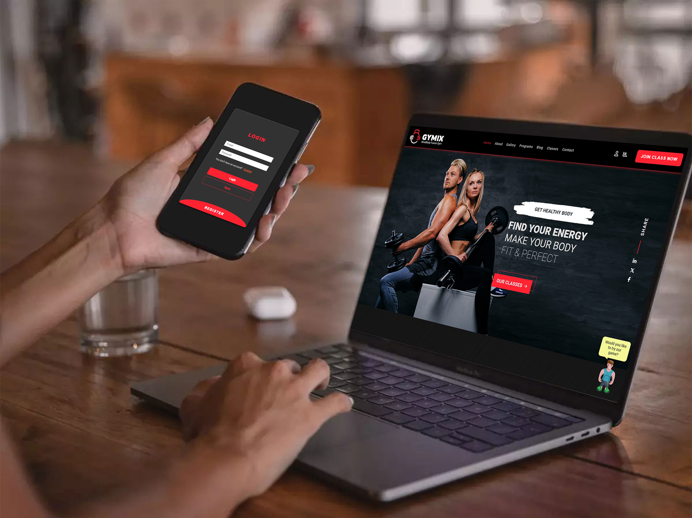
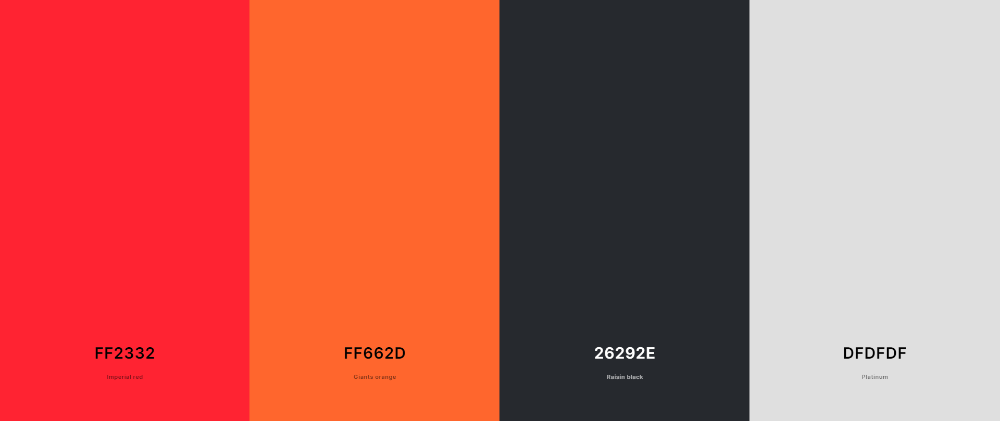
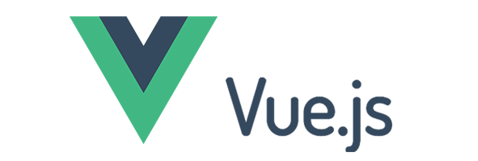
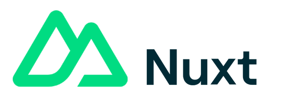
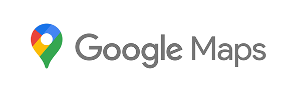
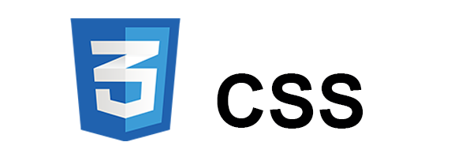

<br>

## 1. Overview

GYMIX is your ultimate fitness and wellness companion, offering a dynamic platform that caters to fitness enthusiasts, health-conscious individuals, and anyone seeking a holistic approach to well-being. The name <strong>GYMIX</strong> represents the fusion of gym workouts, a blend of diverse fitness activities, and engaging games, creating an all-encompassing fitness experience.

<br>

## 2. Description

GYMIX is designed to provide users with an extensive range of features and services aimed at improving their overall health and fitness. Users can customize their workout plans, access a variety of exercise routines, monitor their progress, track fitness goals, and participate in exciting fitness challenges and games.

_Key Features:_

<br>

**Dynamic Animations:**

Dynamic animations for enhanced user engagement, elevating the website's visual appeal.

 <br>

**Fun and Games:**

GYMIX features interactive and simple fitness games, adding an element of enjoyment to workouts. Users can have fun while staying active.

<br>

**Multiple Classes & Programs:**

Select the program that suits you and the days it's available. Gain access to a wide variety of fitness classes and your private trainer.

<br>

**BMI Calculator:**

Calculate your Body Mass Index (BMI) to assess your current fitness level and set personalized fitness goals.

<br>

**User Plan Selection:**

Users can choose a suitable fitness plan tailored to their goals and preferences.

<br>

**View Feedback:**

Access feedback and reviews from other users to gain insights into the effectiveness and quality of fitness programs.

<br>

**Gallery Exploration:**

Explore a wide array of fitness galleries, showcasing workout routines, exercise techniques, and inspiring success stories.

<br>

## 3. Link and Preview



Project link is available at [GYMIX App](https://sport-gymix.netlify.app/)

<br>

## 4. Color guide



<br>

## 5. Built with

<p align="left">




</p>

<br>

## 6. Project Setup

To set up the GYMIX project, follow these steps:

<br>

1. Navigate to the main directory of the project.

2. Run the command `npm install` to install the necessary dependencies.

3. To run the application in development mode, use the command `npm run dev`. This will start the server and client components concurrently, allowing you to test and interact with the GYMIX platform locally.

<br>

## 7. Code structure

```
assets
  └── css
      └── style.css
components
  └── AboutUs.vue
  └── AppFooter.vue
  └── AppHeader.vue
  └── BMI.vue
  └── BoxingBall.vue
  └── BoxingInstructions.vue
  └── Button.vue
  └── Featured.vue
  └── Feedback.vue
  └── Gallery.vue
  └── Gallery3D.vue
  └── GameAvatar.vue
  └── GameInstructions.vue
  └── GameMessage.vue
  └── HeroSection.vue
  └── HomeCard.vue
  └── JoinUs.vue
  └── Logo.vue
  └── PagesHero.vue
  └── Plan.vue
  └── SideBar.vue
  └── Trainers.vue
data
  └── classes.js
  └── programs.js
layouts
  └── custom.vue
  └── default.vue
pages
  └── games
      └── boxing.vue
      └── index.vue
      └── rope.vue
  └── about.vue
  └── classes.vue
  └── contact.vue
  └── gallery.vue
  └── index.vue
  └── login.vue
  └── programs.vue
public
  └── icons
  └── images
      └── about-page
      └── avatar
      └── classes
      └── featured
      └── feedback
      └── gallery
      └── games
      └── readme
      └── sidebar
      └── Trainers
.gitignore
error.vue
nuxt.config.ts
package-lock.json
package.json
README.md
tsconfig.json
```
